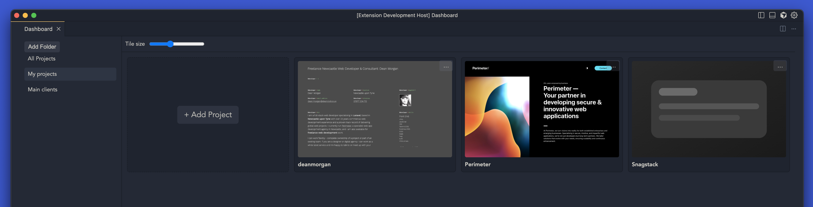

# Dashboard UI

Dashboard home for Cursor/VS Code. Shows on blank windows. Manage projects in a grid with thumbnails, URLs, and folders.



## Features
- Auto-open on new blank window (configurable).
- “+ Add Project” tile at the start of the grid.
- Click tile/image/title to open a project (like Recent).
- Grid with drag-and-drop reordering; hover highlight.
- Folders: organize projects; projects can belong to multiple folders.
- Tile menu: Edit, Upload thumbnail, Generate screenshot, Move to folder, Delete.
- Size slider (toolbar) to change tile size live.
- Thumbnails: upload manually or auto-screenshot via local Chrome/Edge headless.
- Placeholders for missing thumbnails; optional auto-generate for those with URLs.
- Import/Export JSON (images not embedded).
- Metadata (projects/folders) syncs via Settings Sync; thumbnails stay local.

## Commands
- Dashboard UI: Open (`dashboardUi.open`)
- Dashboard UI: Add Current Folder (`dashboardUi.addCurrentFolder`)
- Dashboard UI: Generate Screenshot for Selected (`dashboardUi.screenshotSelected`)
- Dashboard UI: Import (`dashboardUi.import`)
- Dashboard UI: Export (`dashboardUi.export`)
- Dashboard UI: Rename Folder (`dashboardUi.renameFolder`)

## Settings
- `dashboardUi.showOnStartup` (boolean, default true)
- `dashboardUi.confirmOnOpen` (boolean)
- `dashboardUi.screenshot.windowSize` (string, e.g. `1280x800`)
- `dashboardUi.screenshot.browserPaths` (object: override Chrome/Edge path per platform)
- `dashboardUi.autoScreenshotOnMissing` (boolean, default true)
- `dashboardUi.autoScreenshotMaxPerLoad` (number, default 3)

Notes
- Tile size is controlled by the in-UI slider (persisted per-user); the `tileSize` setting is not used.
- Thumbnails are stored locally under the extension’s `globalStorage/thumbnails/` and are not synced.

## Screenshot Notes
Uses system Chrome/Edge via `--headless=new`. If a browser isn’t found, you’ll be prompted to select it. First run may ask for permissions.

## Build (Dev)
```bash
npm install
npm run compile
# Press F5 (Run Extension) to launch an Extension Development Host
```

## Package
```bash
npm run package
```

## Data & Sync
- Metadata (projects/folders) syncs via Settings Sync; thumbnails do not.
- On a new machine: placeholders show; if auto-screenshot is enabled, the extension will generate a few missing thumbnails in the background when URLs are set.
